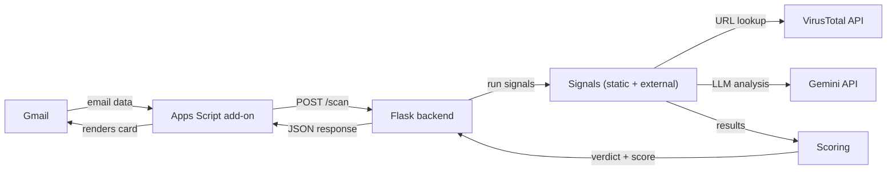

# Email Maliciousness Scorer

A Gmail Add-on that analyzes the open email in real time and returns a maliciousness verdict, risk score, and recommended action.

---

## Overview

This project adds a signal-based scoring engine directly into Gmail, surfacing evidence of malicious intent before the user clicks anything.

The add-on runs as a Gmail sidebar card. When a user opens an email, it automatically sends the email's headers and body to a backend scoring engine, which runs eight independent detection signals in parallel, combines their scores, and returns a verdict: **Safe**, **Suspicious**, **High Risk**, or **Malicious**.

What makes the implementation distinctive:

- **Multi-layer signal architecture**: static header/content analysis, external threat intelligence, and an optional LLM-based holistic analysis via Gemini.
- **Trump card system**: high-confidence signals (executable attachments, VirusTotal consensus) can force a Malicious verdict regardless of the additive score.
- **On-demand AI analysis**: the Gemini signal runs only when the user explicitly requests it, analyzing email content and language for social engineering, urgency manipulation, and other patterns that rule-based signals cannot detect — while preserving API quota and avoiding a slow mandatory round-trip on every email.
- **Security as a first-class constraint**: untrusted input is isolated, prompt injection is mitigated, attachments never leave the client, and outbound calls go to fixed endpoints only.

---

## Demo / usage flow

1. The user opens an email in Gmail. The add-on sidebar activates automatically.
2. The add-on extracts the email's headers, body text, and attachment metadata (filenames, sizes, SHA-256 hashes only), then posts this to the Flask backend.
3. The backend runs eight signals concurrently and returns a scored result within a few seconds.
4. The sidebar renders a card with:
   - A large verdict header (SAFE / SUSPICIOUS / HIGH RISK / MALICIOUS) with a color-coded icon.
   - A risk score out of 100.
   - A recommended action (e.g., "Do not interact with this email. Report to IT and delete.").
   - A collapsible **Analysis Breakdown** listing each triggered signal with its category, explanation, and point contribution.
   - For Suspicious, High Risk, or Malicious emails: a **Run AI Analysis** button that triggers on-demand Gemini LLM analysis and updates the card with the AI's finding.
   - When a known-malicious URL was flagged by VirusTotal: a **View VirusTotal Report** link.

---

## Architecture



### Apps Script vs Flask

The Apps Script add-on is a thin client. Its only responsibilities are extracting email data (which requires Gmail API access that only runs inside Google's runtime), sending it to the backend, and rendering the response as a `CardService` card. All analysis logic lives in Flask.

This split is intentional: Apps Script has severe execution quotas, no useful library ecosystem, and no secret storage. Flask is a normal Python process where signals can use arbitrary libraries, make external API calls, and enforce security boundaries.

### Backend layering

| Layer | Location | Responsibility |
|---|---|---|
| Flask routes | `app.py` | Parse requests, validate fields, construct `Email` objects, return JSON |
| Orchestrator | `orchestrator.py` | Instantiate and run signals; catch per-signal exceptions |
| Signals | `signals/static/`, `signals/external/` | Detect one specific threat indicator; return a `SignalResult` |
| Providers | `providers/` | Wrap external APIs (VirusTotal, Gemini) with rate limiting and error handling |
| Scoring | `scoring.py` | Sum weights, apply trump cards, map score to verdict |

---

## Signals

All signals run on every `/scan` request except `gemini_analysis`, which is on-demand only.

| Signal | Category | Weight | Trump card | What it detects |
|---|---|---|---|---|
| `dmarc` | Authentication | 20 | No | DMARC authentication failed (non-pass result in `Authentication-Results` header) |
| `reply_to_mismatch` | Authentication | 14 | No | `Reply-To` domain differs from `From` domain — BEC/redirect attack pattern |
| `display_name_email_spoof` | Impersonation | 25 | No | Display name contains a different email address than the actual sender |
| `display_name_brand_impersonation` | Impersonation | 12 | No | Display name references a known brand (25 brands) but sender domain is not legitimate |
| `lookalike_domain` | Impersonation | 20 | No | Sender domain within Levenshtein distance 1–2 of a known brand domain (PSL-aware) |
| `url_href_mismatch` | Suspicious Links | 18 | No | Anchor tag visible text shows a different domain than the `href` destination |
| `threat_intel_url` | Suspicious Links | 15 / 25 / 35 | Yes (≥6 vendors) | URLs in HTML body flagged as malicious by VirusTotal vendors |
| `dangerous_extensions` | Dangerous Attachment | 25 | Yes (executable / double-extension) | Attachment filenames with executable or dangerous file extensions |
| `gemini_analysis` | AI Analysis | 0–45 (dynamic) | No | LLM holistic analysis for phishing, social engineering, urgency manipulation, etc. |

**`threat_intel_url` dynamic weight**: 15 (1–2 vendors), 25 (3–5 vendors), 35 (6+ vendors). Trump card fires at ≥6 vendors — the same threshold where the weight maxes out, reflecting broad consensus that the URL is malicious.

**`gemini_analysis` dynamic weight**: mapped from a `(verdict, confidence)` table — ranges from 0 (safe or low-confidence suspicious) to 45 (malicious + high confidence).

---

## Scoring and verdicts

Each triggered signal contributes its weight to an additive score. The score is mapped to a verdict:

| Score range | Verdict |
|---|---|
| ≥ 70 | Malicious |
| 30–69 | High Risk |
| 10–29 | Suspicious |
| < 10 | Safe |

**Trump cards override additive scoring.** If any signal fires with `trump_card=True`, the verdict is forced to **Malicious** regardless of the total score. This handles cases where a single finding is definitive — a document disguised as `invoice.pdf.exe`, or a URL flagged by 6+ VirusTotal vendors, means the email is malicious no matter what other signals say.

---

## Security as a first-class concern

### Untrusted input handling

Every signal wraps its parsing in `try/except`. The orchestrator additionally wraps each `signal.evaluate()` call — if a signal raises for any reason (malformed headers, unexpected encoding, API bug), it is logged and replaced with a non-triggered result. The remaining signals still run and the user still gets a verdict. A pathological email cannot crash the scorer.

See `orchestrator.py: run_signals()` and individual signal `evaluate()` methods.

### Prompt injection mitigation

The Gemini signal is exposed to email body content, which is attacker-controlled. Several layers mitigate prompt injection:

1. **System prompt warning**: the system instruction explicitly states that email content is untrusted data and any instructions inside it must be ignored (`gemini_prompts.py`).
2. **Content delimiters**: the body is wrapped between `=== EMAIL BODY (start) ===` and `=== EMAIL BODY (end) ===` markers in the user prompt, and again inside `=== EMAIL TO ANALYZE ===` in the provider.
3. **Content truncation**: `GeminiProvider` truncates email content to 4,000 characters before sending (`providers/gemini.py: _MAX_CONTENT_CHARS`). This bounds token usage and limits the surface for injection.
4. **Structured output with schema validation**: the model is instructed to return a JSON object with a fixed schema and configured with `response_mime_type="application/json"`. The response is parsed and validated against expected fields and value ranges before use. An unexpected schema returns a non-triggered result.

### Attachment privacy

Raw attachment bytes are never transmitted to the backend. The Apps Script add-on computes a SHA-256 hash client-side using `Utilities.computeDigest()` and sends only the filename, size, and hash (`Code.js: extractEmailData()`). This prevents sensitive document contents from leaving the user's device.

### Secret management

API keys are loaded from a `.env` file via `python-dotenv` at Flask startup (`app.py`). The `.env` file is not committed to the repository. A `.env.example` template is provided. The Apps Script add-on stores no secrets — it uses Google's OAuth for Gmail access.

### SSRF protection

All outbound HTTP calls from the backend go to fixed, hardcoded endpoints: `www.virustotal.com/api/v3` and Google's Gemini API. No user-supplied URL is ever used as a backend call target. URLs extracted from email HTML are passed to VirusTotal as lookup identifiers, not as HTTP destinations.

### Rate limiting

`RateLimiter` (`providers/rate_limit.py`) implements a sliding-window counter using a thread-safe deque. VirusTotal is limited to 4 requests per minute and 500 per day (free tier). Gemini is limited to 15 requests per minute. Exceeded limits return a non-triggered result rather than an error.

### Authentication between add-on and backend

The add-on posts directly to the Flask backend over HTTPS (via ngrok in development). There is currently no shared-secret or token verification on the Flask side — this is a known gap, noted in the limitations section. For the live demo, the backend URL is not publicly advertised and ngrok provides HTTPS transport.

---

## Setup and running

### Prerequisites

- Python 3.10+
- Node.js (for `clasp`)
- A Google account with Gmail
- A [VirusTotal](https://www.virustotal.com) free API key
- A [Google AI Studio](https://aistudio.google.com) API key (Gemini)
- [ngrok](https://ngrok.com) account and CLI

### 1. Backend

```bash
# Clone and enter the repo
cd email-scorer

# Create and activate a virtual environment
python -m venv backend/venv
source backend/venv/bin/activate       # Windows: backend\venv\Scripts\activate

# Install dependencies
pip install -r backend/requirements.txt

# Configure environment variables
cp backend/.env.example backend/.env
# Edit backend/.env and fill in:
#   VIRUSTOTAL_API_KEY=<your key from virustotal.com/gui/my-apikey>
#   GEMINI_API_KEY=<your key from aistudio.google.com/apikey>

# Start Flask
cd backend
python app.py
# Backend listens on http://localhost:8080
```

### 2. ngrok tunnel

```bash
# In a separate terminal
ngrok http 8080
# Copy the https:// forwarding URL (e.g. https://abc123.ngrok-free.app)
```

### 3. Update the add-on backend URL

Open `addon/Code.js` and update:

```javascript
const BACKEND_URL = 'https://<your-ngrok-url>';
```

### 4. Deploy the add-on

```bash
# Install clasp if not already installed
npm install -g @google/clasp

# Authenticate with your Google account
clasp login

# Push the add-on code
cd addon
clasp push
```

Open Gmail, find the add-on in the sidebar, and open any email to run a scan.


---

## Project structure

```
email-scorer/
├── addon/
│   ├── Code.js                      # Add-on entry point, card UI, action handlers
│   ├── appsscript.json              # Manifest: OAuth scopes, trigger, add-on metadata
│   └── .clasp.json                  # Deployment config (script ID)
├── backend/
│   ├── app.py                       # Flask routes: /scan, /scan/llm, /health
│   ├── models.py                    # Email and SignalResult dataclasses
│   ├── orchestrator.py              # Signal runner; on-demand LLM entry point
│   ├── scoring.py                   # Additive scoring, trump cards, verdict mapping
│   ├── requirements.txt             # Python dependencies
│   ├── .env.example                 # Environment variable template
│   ├── providers/
│   │   ├── base.py                  # ThreatIntelProvider abstract interface
│   │   ├── gemini.py                # Gemini 2.5 Flash client; rate limiter; JSON validation
│   │   ├── virustotal.py            # VirusTotal v3 client; dynamic weight; rate limiter
│   │   └── rate_limit.py            # Thread-safe sliding-window rate limiter
│   └── signals/
│       ├── base.py                  # Signal ABC; _make_result helper
│       ├── utils.py                 # parse_from_header, URL extraction
│       ├── data/
│       │   └── brands.py            # 25-brand registry (names, aliases, legitimate domains)
│       ├── static/
│       │   ├── dmarc.py             # DMARC result from Authentication-Results header
│       │   ├── display_name.py      # Email spoof + brand impersonation (two signals)
│       │   ├── lookalike_domain.py  # PSL-aware Levenshtein domain comparison
│       │   ├── url_href_mismatch.py # HTML anchor text vs href domain
│       │   ├── dangerous_extensions.py  # Executable/double-extension attachments
│       │   └── reply_to_mismatch.py # Reply-To vs From domain
│       └── external/
│           ├── threat_intel_url.py  # VirusTotal URL lookup
│           ├── gemini_analysis.py   # On-demand LLM signal with weight table
│           └── gemini_prompts.py    # System prompt and user prompt builder
```

---

## Design decisions

**Apps Script as a thin client, Flask for all logic.**
Apps Script is the only way to access Gmail message content within Google's sandboxed runtime, but it imposes strict execution quotas, has no library ecosystem, and cannot store secrets. Keeping it as a minimal HTTP client means all analysis logic runs in a normal Python environment where signals can use arbitrary libraries and be tested independently.

**Abstract base classes enforce a uniform contract.**
`Signal` (`signals/base.py`) and `ThreatIntelProvider` (`providers/base.py`) are abstract classes that define the interface every signal and provider must implement. The orchestrator calls `signal.evaluate(email)` without knowing which signal it is; signals call `provider.lookup_url(url)` without knowing which API they're talking to.

**Provider layer separated from signal logic.**
Each external API (VirusTotal, Gemini) is wrapped in a provider class that owns authentication, rate limiting, error handling, and response parsing. Signals receive clean result objects, not raw HTTP responses. This separation means a signal never handles a 429 error — it just receives `result.error` — and providers can be injected for testing.

**Per-signal exception isolation in the orchestrator.**
Each signal runs inside its own `try/except` in `orchestrator.py`. If a signal crashes (malformed email, parser bug, unexpected API response), it is logged and replaced with a non-triggered result. This is a deliberate choice: a pathological email that exploits a parsing edge case in one signal must not prevent the rest of scoring from running.

**On-demand LLM analysis.**
The Gemini signal is not in the default scan path — it runs only when the user clicks "Run AI Analysis." This avoids a mandatory 2–5 second Gemini round-trip on every email open, preserves the free-tier API quota (which is low), and lets the user decide when the heuristic signals warrant deeper investigation. The on-demand result is merged server-side with the original scan via `/scan/llm`, which recomputes the verdict over the combined signal set.

**Trump cards for high-confidence signals.**
Some signals produce binary, definitive evidence. An attachment named `invoice.pdf.exe` is not merely suspicious — it is almost certainly malicious regardless of what other signals say. Treating these as additive contributors risks under-scoring them when other signals are quiet. Trump cards short-circuit the verdict to Malicious directly, which matches the actual risk and gives the user an unambiguous signal.

---

## Known limitations

- **ngrok URL changes on restart.** The backend URL is hardcoded in `Code.js` and requires a `clasp push` every time ngrok restarts with a new URL. A stable backend hostname would remove this friction.
- **Gemini API quota is low on the free tier.** The AI analysis button may return "temporarily unavailable" if the daily quota is exhausted. The free Gemini tier has no guaranteed capacity.
- **No shared-secret authentication on the backend.** Any client that knows the ngrok URL can POST to `/scan`. A production deployment would need token-based authentication between the add-on and the backend.
- **No persistent state.** Each scan is stateless. There is no history, no per-user profile, and no feedback loop to improve signal weights over time.
- **Brand list is hand-curated.** The 25-brand registry in `brands.py` covers common targets but misses many. Adding brands requires a code change; there is no dynamic update mechanism.

---

## Future improvements

- **Cloud Run or Fly.io deployment** with a stable HTTPS endpoint, eliminating the ngrok dependency for demos.
- **Additional signals**: WHOIS domain age (newly registered domains are a strong phishing signal), EmailRep.io sender reputation, Google Safe Browsing API for URL lookup, and file hash lookup against known-malicious databases.
- **Dynamic brand registry** loaded from a configuration file or remote source, without requiring a code deployment to add brands.
- **Feedback mechanism**: a thumbs up/down on the card verdict, logged to a simple store, to capture false positives and false negatives for future signal tuning.
- **Shared-secret authentication** between add-on and backend (a pre-shared token sent in an HTTP header, verified on every request).
- **Additional signals**:
  - **Threat intel scanning for attachment hashes** — check SHA-256 hashes of attachments against VirusTotal or another malware reputation provider. The current add-on already sends attachment metadata and hashes only, but the MVP does not yet perform full file-hash reputation lookups.
  - **WHOIS / RDAP domain age** — detect newly registered sender domains, which are often used in phishing campaigns. This was deferred because it requires network calls, timeout handling, and graceful degradation.
  - **Email sender reputation** — integrate a provider such as EmailRep.io to identify senders with a known abuse history, suspicious reputation, or recent first-seen date.
  - **Google Safe Browsing URL reputation** — add another URL intelligence source alongside VirusTotal to improve URL coverage and reduce dependence on a single external provider.
  - **IP reputation checks** — analyze sending infrastructure reputation when a reliable originating IP can be extracted from email headers. This was deferred because Gmail `Received` headers can be difficult to interpret reliably.
  - **Mailed-by / signed-by consistency** — compare authentication-related domains with the visible `From` domain to catch suspicious sender alignment issues beyond DMARC.
  - **Shortened URL detection** — flag links that use URL shorteners such as bit.ly or tinyurl. This is a weak signal and would need low weight to avoid false positives.
  - **Sender history with recipient** — use prior correspondence history as a trust signal. This was deferred because it requires broader Gmail permissions and introduces privacy and performance concerns.
  - **Image-based phishing detection** — analyze inline images or screenshots for phishing content that may not appear in the email text.
  - **Sandbox detonation for unknown attachments** — execute or inspect suspicious files in a sandbox to detect novel malware that hash-based scanning misses.

